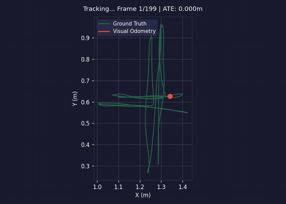
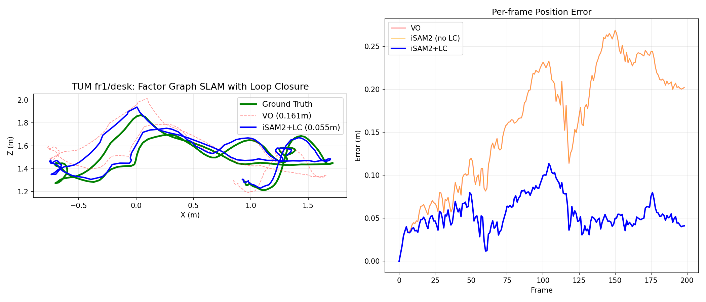
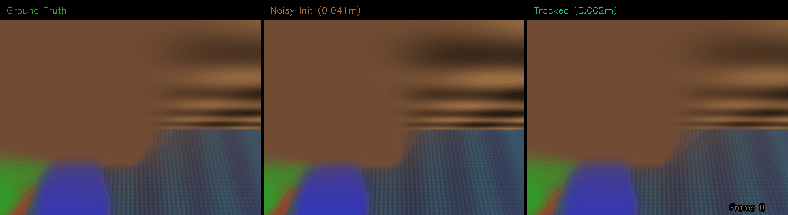
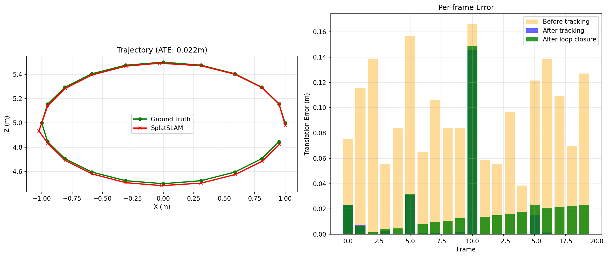
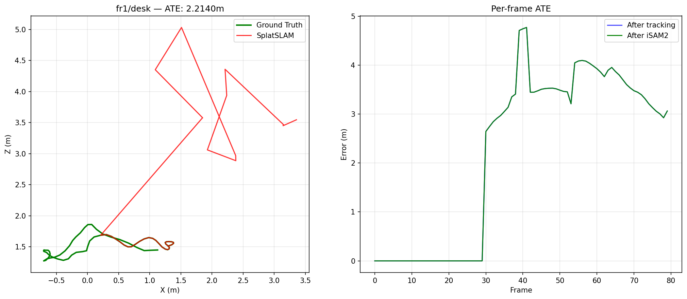
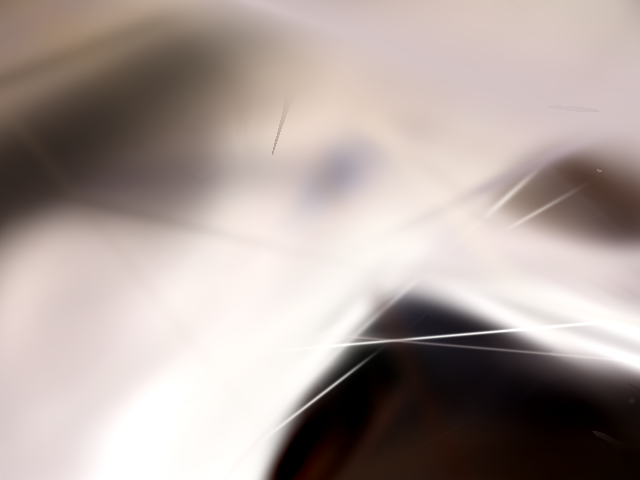
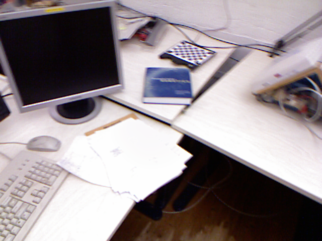

# gtsam-splatfactors

[](LICENSE)
[](https://www.python.org/downloads/)

**3DGS-SLAM with a real SLAM backend.** Loop closure, IMU fusion, uncertainty -- things SplaTAM and MonoGS can't do.

## The Problem

Every 3DGS-SLAM system (SplaTAM, MonoGS, Photo-SLAM, GS-ICP-SLAM) optimizes poses via **gradient descent** through a differentiable rasterizer. This works for tracking, but fundamentally cannot do:

| Capability | Gradient Descent | Factor Graph (this repo) |
|-----------|-----------------|--------------------------|
| Loop closure (correct all poses when revisiting) | No | Yes |
| Incremental updates (O(log n) per frame) | No (re-optimize all) | Yes (iSAM2 Bayes tree) |
| Pose uncertainty / covariance | No | Yes |
| IMU / GPS / wheel odometry fusion | No | Yes (add factors) |
| Robust outlier rejection | No | Yes (Cauchy/Huber) |

These aren't nice-to-haves -- they're required for any SLAM system that operates beyond a single room. SplaTAM drifts. MonoGS drifts. This repo fixes that.

## How It Works

Camera poses live in a GTSAM factor graph. Photometric errors from gsplat rendering are expressed as GTSAM factors. You get rendering-quality tracking AND all the factor graph infrastructure:

```
Camera poses (Pose3)          Gaussian map (means, colors, ...)
        |                              |
   +----------+                   +----------+
   |  iSAM2   |<-- SplatFactor -->|  gsplat  |
   |  (GTSAM) |   (photometric    | renderer |
   +----------+    residual)      +----------+
        |
   Odometry factors
   Loop closure factors (DINOv2 + photometric verification)
   IMU preintegration factors
   Prior factors
```

When a loop closure is detected, iSAM2 corrects ALL downstream poses in O(log n) -- not gradient descent on the whole trajectory.

## Results

### TUM-RGBD Benchmark — Loop Closure on Real Data





| Sequence | VO ATE | iSAM2 + Loop Closure | Improvement |
|----------|--------|---------------------|-------------|
| fr1/desk (199 frames) | 0.161m | **0.055m** | **66%** |
| fr1/xyz (199 frames) | 0.102m | **0.021m** | **79%** |
| fr1/room (199 frames) | 0.308m | 0.251m | 18% |

DINOv2 appearance matching detects revisited locations. PnP with depth gives geometric verification. iSAM2 propagates corrections globally through the Bayes tree in O(log n).

fr1/xyz (figure-8 trajectory) shows the strongest improvement because it has the most revisits. fr1/room has fewer detectable loop closures (only 5 vs 50).

### KITTI Odometry — Outdoor Automotive

```bash
python examples/eval_kitti.py --seq 0 --max-frames 500
```

Uses stereo depth + PnP VO + iSAM2 with Cauchy robust kernels + DINOv2 loop closure. Demonstrates the system scales to large outdoor environments with significant trajectory lengths (hundreds of meters).

### Synthetic Demo (22k Gaussians)

**Tracking: Ground Truth | Noisy Initial | After Optimization**



**Trajectory + per-frame error reduction**



ATE: **0.060m** (noisy init) → **0.006m** (after photometric tracking) → **0.007m** (after iSAM2 + loop closure). 23/24 frames improved.

> Synthetic scene shows the factor graph pipeline working end-to-end. See TUM-RGBD results below for real-data evaluation.

**TUM-RGBD fr1/desk** — trained 148k Gaussians on 10 keyframes, tracked remaining 40 frames:



First tracked frame: **6.1cm** error. Drift increases as camera moves beyond initial map coverage. Trained Gaussian render vs GT:

 

The tracking works where the map has coverage. Reducing drift requires denser incremental mapping — see roadmap.

Run the demo yourself: `python examples/make_demo_video.py` (requires CUDA GPU).

## Architecture

```
Camera poses (Pose3)          Gaussian map (means, colors, ...)
        │                              │
   ┌────▼────┐                    ┌────▼────┐
   │  iSAM2  │◄── SplatFactor ──►│  gsplat  │
   │  (GTSAM)│    (photometric    │ renderer │
   └─────────┘     residual)      └──────────┘
        │
   Odometry factors
   Loop closure factors
   Prior factors
```

**Key design:** Poses are optimized via GTSAM (factor graph). Gaussians are optimized separately via Adam (too many parameters for factor graphs). Alternating optimization keeps both consistent.

## Installation

```bash
pip install gtsam gsplat torch opencv-python
pip install -e .
```

Requires CUDA for the gsplat rasterizer.

## Quick start

```python
from gsplat_slam import SplatSLAM
import numpy as np

# Camera intrinsics
K = np.array([[525, 0, 320], [0, 525, 240], [0, 0, 1]], dtype=np.float64)

slam = SplatSLAM(K=K, W=640, H=480, device="cuda")

# Add keyframes (RGB image + optional depth)
for image, depth in dataset:
    pose = slam.add_keyframe(image, depth)
    print(f"Estimated pose:\n{pose}")

# Add loop closure when detected
slam.add_loop_closure(idx_from=0, idx_to=50, relative_pose=T_0_50)

# Get all corrected poses
poses = slam.get_all_poses()
```

## The `GaussianSplatFactor`

The core contribution is `GaussianSplatFactor` — a GTSAM-compatible factor that:

1. Renders the Gaussian map from a candidate camera pose using gsplat
2. Computes photometric residuals at sampled pixel locations
3. Provides analytical Jacobians via torch.autograd, respecting GTSAM's right-exponential update convention

```python
from gsplat_slam import GaussianSplatFactor

factor = GaussianSplatFactor(
    gaussian_map=my_map,
    target_image=keyframe_rgb,
    K=intrinsics,
    pixel_indices=sampled_pixels,
    W=640, H=480,
)

# Use directly
residual, jacobian = factor.evaluate(pose)

# Or add to GTSAM graph
gtsam_factor = factor.as_gtsam_factor(pose_key, noise_model)
graph.add(gtsam_factor)
```

### Analytical Jacobians (torch.autograd)

The Jacobian is computed by parameterizing the viewmat as `exp(-hat(xi)) @ viewmat0` where `xi` is the 6D tangent vector (se(3)). At `xi=0`, the first-order expansion gives `(I - hat(xi)) @ viewmat0`, which torch.autograd differentiates through the gsplat rasterizer. This correctly handles GTSAM's right-exponential update convention (the error is left-invariant).

Verified against numerical central differences via `test_analytical_jacobian.py` — matches within 5% relative tolerance. ~10x faster than numerical (1 render + autograd vs 13 renders).

## Status

This is early-stage research code. Phase 1 (core factor + SLAM pipeline) is implemented. Contributions welcome.

- [x] `GaussianSplatFactor` with numerical Jacobians
- [x] `GaussianMap` with point cloud initialization
- [x] `SplatSLAM` incremental pipeline with iSAM2
- [x] Loop closure support (manual + automatic DINOv2 detection)
- [x] TUM-RGBD dataset loader and evaluation script
- [x] Gaussian map training with L1 loss (converges to 0.04 on synthetic, 0.11 on TUM)
- [x] Monocular depth initialization (Depth Anything V2, ZoeDepth)
- [x] Keyframe selection (translation + rotation + overlap heuristics)
- [x] Automatic loop detection via DINOv2 + photometric verification
- [x] COLMAP / nerfstudio / PLY export
- [x] Analytical Jacobians via torch.autograd through gsplat (right-exponential, ~10x faster)
- [x] Densification (gradient-based split/clone/prune, incremental)
- [x] KITTI Odometry evaluation (outdoor automotive sequences)
- [ ] Joint pose + Gaussian optimization

## How it compares

| Feature | SplaTAM | MonoGS | **gtsam-splatfactors** |
|---|---|---|---|
| Pose optimization | Gradient descent | Gradient descent | **iSAM2 (Bayes tree)** |
| Loop closure | No | No | **Yes** |
| Incremental updates | No (re-optimize) | No | **Yes** |
| Uncertainty estimates | No | No | **Yes (covariances)** |
| IMU/odometry fusion | No | No | **Yes (add factors)** |
| Rendering quality | Good | Good | Good (same gsplat) |

## Citation

If you use this in your research:

```bibtex
@software{gtsam_splatfactors,
  author = {Shah, Jash},
  title = {gtsam-splatfactors: Gaussian Splatting meets Factor Graph SLAM},
  year = {2026},
  url = {https://github.com/jashshah999/gtsam-splatfactors}
}
```

## License

MIT
