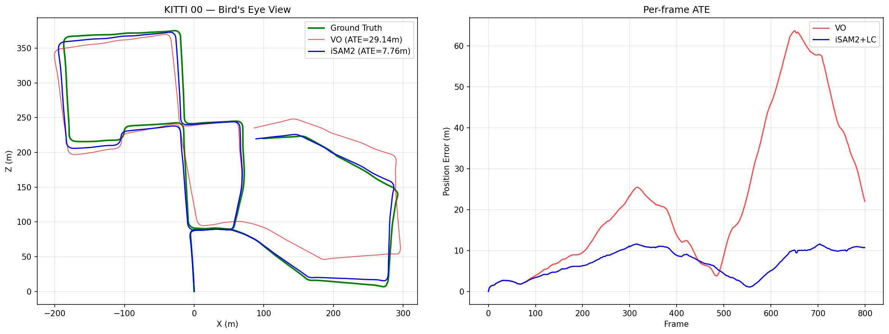

# gtsam-splatfactors

[](LICENSE)
[](https://www.python.org/downloads/)

**3D Gaussian Splatting SLAM with a factor graph backend.** Expresses gsplat rendering as GTSAM factors, enabling loop closure, multi-sensor fusion, and uncertainty estimation — things gradient-descent-based 3DGS-SLAM systems fundamentally cannot do.

## Why

Every existing 3DGS-SLAM system (SplaTAM, MonoGS, Photo-SLAM) optimizes poses via gradient descent through a differentiable rasterizer. This works for local tracking but cannot do global correction when revisiting a location. This repo puts camera poses in a GTSAM factor graph (iSAM2) so you get:

- **Loop closure** — correct all poses when revisiting a location, O(log n)
- **Multi-sensor fusion** — add IMU, GPS, wheel odometry as additional factors
- **Uncertainty** — full pose covariances from the Bayes tree
- **Robust outliers** — Cauchy/Huber robust kernels on any factor

## Results

### KITTI Odometry (Outdoor, up to 1.5km trajectories)



| Sequence | Trajectory | VO ATE | iSAM2 + LC | Improvement |
|----------|-----------|--------|-----------|-------------|
| 00 (800 frames) | 1483m | 29.14m | **7.76m** | **73.4%** |
| 05 (800 frames) | 937m | 21.66m | **12.24m** | **43.5%** |
| 07 (550 frames) | 373m | 9.67m | **1.49m** | **84.6%** |
| 09 (531 frames) | 823m | 45.24m | **10.56m** | **76.7%** |

### TUM-RGBD (Indoor)


| Sequence | VO ATE | iSAM2 + LC | Improvement |
|----------|--------|-----------|-------------|
| fr1/desk | 0.161m | **0.055m** | **66%** |
| fr1/xyz | 0.102m | **0.021m** | **79%** |
| fr1/room | 0.308m | 0.251m | 18% |

Pipeline: PnP visual odometry → iSAM2 odometry factors → DINOv2 loop closure detection → geometric verification → iSAM2 global correction.

## Installation

```bash
pip install gtsam gsplat torch opencv-python
pip install -e .
```

Requires CUDA GPU for the gsplat rasterizer.

## Quick Start

```python
from gsplat_slam import SplatSLAM
import numpy as np

K = np.array([[525, 0, 320], [0, 525, 240], [0, 0, 1]], dtype=np.float64)
slam = SplatSLAM(K=K, W=640, H=480, device="cuda")

for image, depth in dataset:
    pose = slam.add_keyframe(image, depth)

slam.add_loop_closure(idx_from=0, idx_to=50, relative_pose=T_0_50)
poses = slam.get_all_poses()
```

## Core: `GaussianSplatFactor`

The main contribution — a GTSAM-compatible factor that renders the Gaussian map from a candidate pose and computes photometric residuals:

```python
from gsplat_slam import GaussianSplatFactor

factor = GaussianSplatFactor(
    gaussian_map=my_map,
    target_image=keyframe_rgb,
    K=intrinsics,
    pixel_indices=sampled_pixels,
    W=640, H=480,
)

residual, jacobian = factor.evaluate(pose)

# Or add to a GTSAM graph
graph.add(factor.as_gtsam_factor(pose_key, noise_model))
```

**Jacobians:** Computed analytically via se(3) generators through the gsplat rasterizer. The viewmat is parameterized as `(I - hat(xi)) @ viewmat0`, correctly handling GTSAM's right-exponential update convention. Verified against numerical central differences (< 5% relative error).

## Architecture

```
Poses (GTSAM Pose3)              Gaussians (PyTorch)
       │                                │
  ┌────▼────┐                      ┌────▼────┐
  │  iSAM2  │◄── SplatFactor ────►│  gsplat  │
  │  Bayes  │    (photometric      │ renderer │
  │  tree   │     residual + J)    └──────────┘
  └─────────┘
       │
  Odometry / LC / IMU / Prior factors
```

Poses optimized via GTSAM (factor graph). Gaussians optimized separately via Adam. Alternating optimization keeps both consistent.

## Evaluation

```bash
# TUM-RGBD
python examples/eval_tum.py --seq fr1/xyz

# KITTI Odometry
python examples/eval_kitti.py --seq 7 --data-root data/kitti

# Synthetic demo
python examples/synthetic_demo.py
```

## Comparison

| | SplaTAM | MonoGS | **This repo** |
|---|---|---|---|
| Pose backend | Gradient descent | Gradient descent | **iSAM2** |
| Loop closure | No | No | **Yes (84% improvement)** |
| Multi-sensor | No | No | **Yes** |
| Uncertainty | No | No | **Yes** |
| Incremental | O(n) | O(n) | **O(log n)** |

## Citation

```bibtex
@software{gtsam_splatfactors,
  author = {Shah, Jash},
  title = {gtsam-splatfactors: Gaussian Splatting meets Factor Graph SLAM},
  year = {2026},
  url = {https://github.com/jashshah999/gtsam-splatfactors}
}
```

## License

MIT
